# Introduction

La présente documentation, à destination des développeurs, a pour objectif de présenter le détail du fonctionnement du processus de mise en cohérences des données de type réseau aux frontières ainsi que les principaux outils mis en oeuvre.

# Installation

## Code source 

Le code source de l'application est disponible sur le dépôt [area_matching](https://github.com/openmapsforeurope2/area_matching.git)

## Dépendances 

L'installation de l'application nécessite la compilation préalable de bibliothèques internes et externes à l'IGN.

Voici le graphe des dépendances :

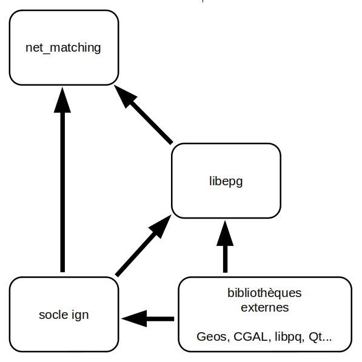

### Socle IGN 

Le socle logiciel de l'IGN regroupe un ensemble de bibliothèques développées en interne qui permettent d'unifier l'accès aux bibliothèques c++ de traitement et de stockage de données géographiques.
On y trouve notamment des modèles de données pivots (géométries, objet attributaire), des fonctions de lecture/écriture de conteneurs d'objets, des opérations sur les géométries, de nombreux algorithmes et outils spécifiquement conçus pour répondre à des problématiques géomaticiennes...

Le code source du socle ce trouve sur le dépôt [sd-socle](http://gitlab.forge-idi.ign.fr/socle/sd-socle.git)

### LibEPG 

Cette bibliothèque, développée à l'IGN et s'appuyant essentiellement sur le socle logiciel, contient de nombreux algorithmes et fonctions utilitaires dédiés spécifiquement aux besoins des produits européens (EGM/ERM) ainsi qu'au projet [OME2](https://github.com/openmapsforeurope2/OME2).
Elle comporte essentiellement des fonctions de généralisations, des fonctions utiles au management du processus tels que des utilitaires de log, d'orchestration, de gestion du contexte).
On y trouve également des opérateurs permettant d'encapsuler des objets géométriques complexes afin d'en optimiser la manipulation (par l'utilisation de graphes, d'indexes...) et ainsi d'accroitre les performances globales des processus.

Le code source de la bibliothèque libepg ce trouve sur le dépôt [libepg](http://gitlab.dockerforge.ign.fr/europe/libepg.git)


# Configuration

L'outil s'appuie sur de nombreux paramètres de configuration permettant d'adapter le comportement des algorithmes en fonctions des spécificités nationales (sémantique, précision, échelle, conventions de modélisation...).

On trouve dans le [dossier de configuration](https://github.com/openmapsforeurope2/net_matching/tree/main/config) les fichiers suivants :

- epg_parameters.ini : regroupe des paramètres de base issus de la bibliothèque libepg qui constitue le socle de développement l'outil. Ce fichier est aussi le fichier chapeau qui pointe vers les autres fichiers de configurations.
- db_conf.ini : informations de connexion à la base de données.
- theme_parameters.ini : configuration des paramètres spécifiques à l'application.


# Fonctionnement du processus

Le traitement de raccordement des objets linéaires est lancé pour un couple de pays frontaliers.

## Etapes préliminaires

Les données sur lesquelles ce traitement est lancé doivent avoir été nettoyées en amont à l'aide de l'outil **clean** du projet [data-tools](https://github.com/openmapsforeurope2/data-tools) qui permet de supprimer les objets trop éloignés de leur pays.
Cet outil doit être utilisé sur des tables de travail dans lesquelles sont extraites les données des deux pays à traiter autour de leur frontière commune.


## Principe général du traitement

Le processus de mise en cohérence des réseaux est décomposé en une succession d'étapes clés.
Afin d'orchestrer l'enchainement de ces étapes l'application utilise l'outil **epg::step::StepSuite** de la bibliothèque **libepg**. Ce dernier permet de lancer une succession de **epg::step::Step** dans lesquels sont implémentés les traitements de chaque étape.
Un code (numéro à trois chiffres) est attribué à chaque étape. Les étapes sont ordonnancées selon cette numérotation. Si une étape transforme les données sur lesquelles elle travaille, une ou plusieurs tables dédiées préfixées du code de l'étape sont créées. Ces créations sont réalisées en copiant les tables d'une étape antérieure (qui n'est pas nécessairement l'étape immédiatement antérieure, car toutes les étapes ne travaillent pas sur les mêmes données).
Ce fonctionnement permet de conserver les résultats intermédiaires du processus. Cela donne la possibilité d'arrêter et de reprendre le traitement en cours de processus et facilite le travail de d'analyse et de deboggage.


Les étapes qui composent le traitement de raccordement sont les suivantes :

**201** - initialisation du champ 'fictitious' des arcs du réseau
<br>
**202** - appariement des carrefours
<br>
**204** - généralisation des surfaces étroites en linéaires (les contours des surfaces sont constituées des arcs des 2 pays et les linéaires résultant de la fusion de ces arcs sont bi-nationaux)
<br>
**210** - génération des _'connectings lines'_ projetées aux frontières pour chacun des pays frontaliers
<br>
**211** - fusion des _'connecting lines'_ de chacun des pays en linéaires bi-nationaux
<br>
**212** - accrochage des _'connecting lines'_ dont les extrémités sont proches pour éviter les petites coupures
<br>
**213** - suppression des _'connecting lines'_ dont les couples de linéaires sont incohérents selon l'angle ou la distance
<br>
**214** - calcul de la géométrie des _'connecting lines'_ par interpolation
<br>
**220** - connection du réseau aux _'connecting lines'_
<br>
**230** - import des _'connecting lines'_ dans le réseau
<br>
**240** - génération des _'connecting points'_
<br>
**250** - connection du réseau aux _'connectingacun des pays en linéaires bi-nationaux
<br>
**212** - accrochage des _'connecting lines'_ dont les extrémités sont proches pour éviter les petites coupures
<br>
**213** - suppression des _'connecting lines'_ dont les couples de linéaires sont incohérents selon l'angle ou la distance
<br>
**214** - calcul de la géométrie des _'connecti points'_
<br>
**255** - généralisation des surfaces étroites en linéaires bi-nationaux
<br>
**260** - nettoyage des artefacts (faces étroites, antennes, arcs superposés...)
<br>
**270** - connection des antennes hors pays au réseau du pays voisin
<br>
**280** - nettoyage des artefacts (faces étroites, antennes, arcs superposés, arcs de petite taille...)

> _Précisions_ :
> - _'Connecting line' : arc résultant de la fusion de deux arcs de deux pays différents réprésentant la même portion de réseau._
> - _'Connecting point' : sommet représentant un point de passage du réseau à la frontière. Les réseaux des deux pays limitrophes doivent être connectés à ce point afin d'assurer la continuité topologique du référentiel européen._
> - _champ 'fictitious' : la valeur de ce champ est 'vraie' lorsqu'un arc est couvert par une géométrie surfacique représentant le même objet (certains réseaux possèdes deux représentations linéaire et surfacique modélisées par deux classes d'objets différentes. Tous les objets linéaires n'ont pas de représentation surfacique)._

L'outil **epg::step::StepSuite** donne la possibilité de ne lancer que certaines étapes ou une plage de plusieurs étapes.

La liste de l'ensemble des étapes qui constituent le processus de raccordement diffère selon le réseau traité :
- cours d'eau (table hy.watercourse) : étapes 201 à 280
- tronçons routiers (table tn.road_link) :  étapes 210 à 280
- tronçons de voies ferrées (table tn.railway_link) : étapes 240 à 280

## Configuration

L'outil s'appuie sur de nombreux paramètres de configuration permettant d'adapter le comportement des algorithmes en fonctions des spécificités nationales (sémantique, précision, échelle, conventions de modélisation...).

On trouve dans le [dossier de configuration](https://github.com/openmapsforeurope2/net_matching/tree/main/config) les fichiers suivants :

- epg_parameters.ini : regroupe des paramètres de base issus de la bibliothèque libepg qui constitue le socle de développement l'outil. Ce fichier est aussi le fichier chapeau qui pointe vers les autres fichiers de configurations.
- db_conf.ini : informations de connexion à la base de données.
- theme_parameters_watercourse_link.ini : configuration des paramètres spécifiques au réseau de cours d'eau.
- theme_parameters_railway_link.ini : configuration des paramètres spécifiques au réseau de voies ferrées.
- theme_parameters_road_link.ini : configuration des paramètres spécifiques au réseau routier.


## Lancement du traitement

L'outil s'utilise en ligne de commande.
Le traitement peut être lancé sur trois types de réseaux :
- routier (code tn)
- férré (code ra)
- hydrographique (code hy)

<br>

Les paramètres sont les suivants :
* c [obligatoire] : chemin vers le fichier de configuration
* s [obligatoire] : suffix de la table de travail
* as [optionnel] : suffix des tables de travail des surfaces (à utiliser uniquement lors du traitement de la classe d'objets watercourse_link)
* t [obligatoire] : nom de la classe d'objet (doit être parmi les valeurs : road_link, railway_link, watercourse_link)
* sp [obligatoire] : code de l'étape(s) à executer (exemples: 220 ou 220,240 ou 210-280...)
* arguments libres [obligatoire] : codes des deux pays frontaliers

<br>

Exemple de lancement du traitement complet sur le couple de pays France (code pays 'fr') et Belgique (code pays 'be') pour le thème routier :
```
bin/net_matching --c path/to/config/epg_parameters.ini --s 20251118 --t road_link be fr
```

Exemple du lancement d'une seule étape :
```
bin/net_matching --c path/to/config/epg_parameters.ini --s 20251118 --t road_link -sp 240 be fr
```

Exemple de lancement d'une plage d'étapes :
```
bin/net_matching --c path/to/config/epg_parameters.ini --s 20251118 --t road_link -sp 240-260 be fr
```
Ici toutes les étapes de 240 à 260 (incluses) sont jouées.


## Les étapes - fonctionnement détaillé

### 201 : CorrectCountryConnectivity

Lors de cette étape il est question de corriger la cohérence topologique du réseau, car une bonne connectivité est nécessaire au bon déroulement du processus de raccordement. En effet, les données sources fournies par les organismes producteurs peuvent présenter des problèmes de connectivité (les arcs connectés doivent avoir un sommet en commun). Cela peut relever d'erreur lors de l'acquisition ou de choix délibérés de modelisation.
Par exemple, en ce qui concerne le réseau le réseau hydrographique, certain pays peuvent faire le choix de ne pas couper les tronçons des cours d'eaux principaux au niveau des points de confluence.

Deux types de corrections sont opérées par le processus:
- la création de connexion manquante par découpage des arcs situés à proximité de sommets d'autres arcs, puis connection du résultat de la découpe à ces sommets.
- la correction de la connexion de sommets très proches mais ne possédant pas précisemment les mêmes coordonnées.

#### Données de travail :

| table                          | entrée | sortie | entitée de travail | description                                                 |
|--------------------------------|--------|--------|--------------------|-------------------------------------------------------------|
| EDGE_TABLE_INIT                | X      | X      | X                  | table du réseau à traiter                                   |

#### Principaux opérateurs de calcul utilisés :
- app::calcul::ConnectivityCorrectorOp

#### Description du traitement :
Paramètre utilisés: 
| paramètre                       | description                                                                                        |
|---------------------------------|----------------------------------------------------------------------------------------------------|
| CC_DIST_THRESHOLD               | distance seuil à partir de laquelle il faut établir une connexion                                  |
| NATIONAL_IDENTIFIER_NAME        | nom du champ pour l'identifiant national                                                           |


Pour la création des connexions manquantes, dans un soucis de performance, on charge préalablement en mémoire l'ensemble des géométries des arcs du réseau et on enregistre les relations d'adjacence existantes.
Ensuite on parcourt les sommets et pour chacun d'eux on detecte la présence éventuelle d'un arc non-adjacent 'e' situé à une distance inférieur à la distance seuil _CC_DIST_THRESHOLD_. Le cas échéant on enregistre ce point comme futur point de coupure de l'arc 'e'.
Enfin pour chacun des arcs possédant un ou plusieurs points de coupure, on procéde à la découpe. L'arc original est effacé et remplacé par les arcs issus de la découpe. De nouveaux identifiants _NATIONAL_IDENTIFIER_NAME_ sont créés pour les nouveaux arcs en prenant comme base l'identifiant de l'arc original auquel on ajoute un suffix incrémental (par exemple si un objet possédant l'identifiant <id> est découpé en trois objets ces objets auront pour identifiant <id>_1, <id>_2 et <id>_3).

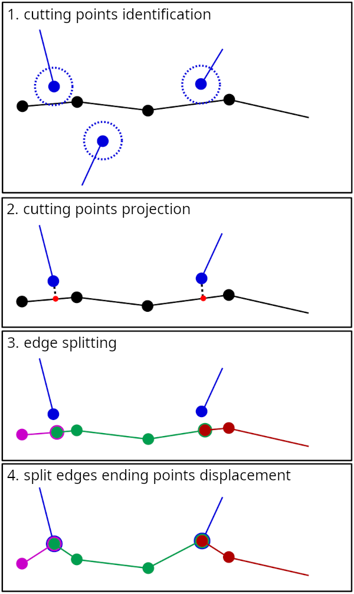

Pour la corrections des connexion, comme précédemment, on charge l'ensemble des informations nécessaires au traitement en mémoire (géométries des arcs, informations sur les sommets...).
Le principe du traitement consiste à itérer sur les sommets et pour chaque sommet parcouru (qui devient le sommet de référence), chercher les autres sommets situés à une distance inférieures au seuil _CC_DIST_THRESHOLD_, puis, pour chacun des arcs auquels appartiennent ces sommets, on remplace sur les géométries stockées en mémoire l'extrémité correspondante par la géométrie du point de référence.
L'ensemble des arcs modifiés sont enregistré en base de données en fin de traitement.
A noter que le point de référence (sommet restant fixe, vers lequel les autres sommets sont déplacés) est arbitrairement choisi parmi l'ensemble des sommets devant être connectés car cela dépend de l'ordre dans lequel l'algorithme parcourt les sommets.

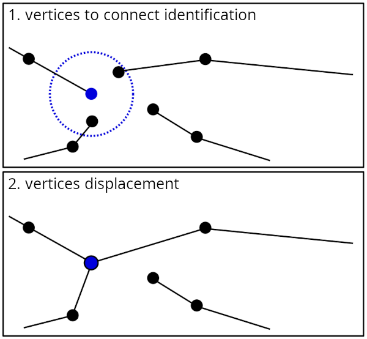

### 202 : FillFictitiousField

Cette étape est spécifique au réseau hydrographique. Elle consiste à renseigner et/ou corriger le champ _EDGE_FICTITIOUS_NAME_ (indiquant si un arc est fictif) qui peut être manquant ou mal renseigné dans les donnnées sources livrées par les producteurs nationaux.
Le réseau hydrographique est réprésenté par deux classes d'objets linéaires (table watercourse_link) et surfaciques (tables watercourse_area et standing_water). Un arc du réseau d'objets linéaires est marqué comme _'fictif'_ s'il est recouvert par un objet surfacique représentant le même élément hydrographique du monde réel.

Il est à noter que la mise en cohérence des surfaces hydrographiques doit avoir été réalisée préalablement à l'initialisation du champ _EDGE_FICTITIOUS_NAME_ réalisé ici car le processus de mise en cohérence peut conduire à la suppression de surfaces et portions de surfaces.

#### Données de travail :

| table                          | entrée | sortie | entitée de travail | description                                                 |
|--------------------------------|--------|--------|--------------------|-------------------------------------------------------------|
| EDGE_TABLE_INIT                | X      | X      | X                  | table du réseau à traiter                                   |
| WATERCOURSE_AREA_TABLE         | X      |        |                    | table des cours d'eau surfaciques                           |
| STANDING_WATER_TABLE           | X      |        |                    | table des surfaces d'eau                                    |


#### Principaux opérateurs de calcul utilisés :
- app::calcul::FillFictitiousFieldOp

#### Description du traitement :
Paramètre utilisés: 
| paramètre                       | description                                                                                        |
|---------------------------------|----------------------------------------------------------------------------------------------------|
| EDGE_FICTITIOUS_NAME            | nom du champ indiquant si l'objet est fictif                                                       |
| FFF_RATIO                       | ratio de recouvrement avec une surface à partir duquel un arc du réseau est considéré comme fictif |

On parcourt l'ensemble des arcs du réseau et pour chacun d'entre eux on calcule leur intersection avec les surfaces du même pays. On en déduit le ratio _longueur_recouverte/longeur_totale_. si ce ratio dépasse le seuil _FFF_RATIO_ le champ _EDGE_FICTITIOUS_NAME_ sera marqué comme 'vrai', sinon il sera marqué 'faux' (le champ peut avoir été injustement marqué 'vrai' dans les données sources).

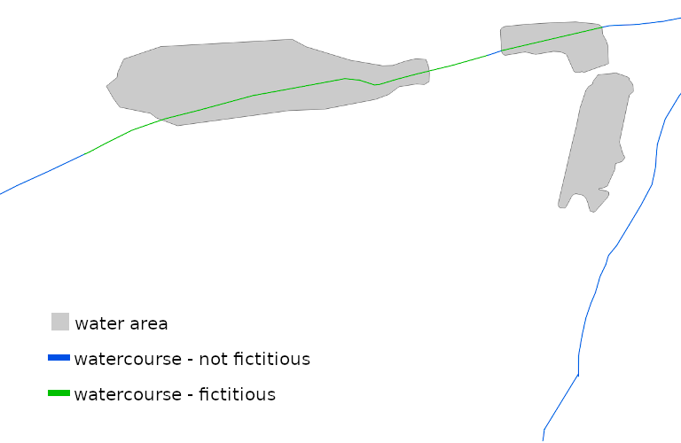


### 203 : JunctionMatching

Dans cette étape il est question d'appairer les carrefours (noeuds de degré supérieur à deux) des deux pays. Puis, pour chaque couple de carrefours appairés, réaliser les déplacements nécessaires pour que leur localisation soit identique.
C'est une étape préparatoire qui permet de faciliter le travail de raccordement des zones complexes que sont les carrefours et d'éviter la création d'artefacts non désirés.


#### Données de travail :

| table                          | entrée | sortie | entitée de travail | description                                                 |
|--------------------------------|--------|--------|--------------------|-------------------------------------------------------------|
| EDGE_TABLE_INIT                | X      | X      | X                  | table du réseau à traiter                                   |

#### Principaux opérateurs de calcul utilisés :
- app::calcul::JunctionMatchingOp

#### Description du traitement :
Paramètre utilisés: 
| paramètre                       | description                                          |
|---------------------------------|------------------------------------------------------|
| EDGE_FICTITIOUS_NAME            | nom du champ indiquant si l'objet est fictif         |
| JM_MAX_DIST                     | distance maximale entre deux carrefours appairables  |

Les réseaux des deux pays sont chargés dans deux graphs séparés.
La première étape de ce traitement consiste ensuite à parcourir tous les noeuds de degré supérieur à deux d'un graph et identifier leur meilleur candidat dans l'autre graph. L'opération inverse est ensuite réalisée. On peut alors dresser la liste des carrefours appairés (ce sont ceux qui sont réciproquement meilleurs candidats).
La seconde étape consiste à réaliser les déplacements pour que les deux carrefours convergent au même point. Si l'un des deux carrefours est fictif (possède au moins un arc incident fictif) le carrefour non-fictif est déplacé vers le carrefour fictif. Cela permet de conserver la cohérence entre les arc fictifs et les surfaces. Si les carrefours sont tous deux fictifs ou non-fictifs il sont tous les deux déplacés vers un point médian situé entre les deux carrefours.
Afin de minimiser les modifications géométriques sur les arcs du réseau seul l'extrémité des arcs sont déplacés, les points intermédiaires ne sont pas modifiés. Cela peut avoir pour conséquence la création de rebroussements.

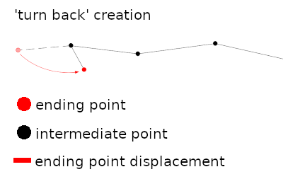

Afin d'éviter la création de rebroussement le principe constiste à projeter le point cible (point vers lequel l'extrémité de la polyligne doit être déplacée) sur la polyligne à déplacer, réaliser une découpe de la polyligne avec le point projeté, puis déplacer l'extrémité de la polyligne découpé vers le point cible.

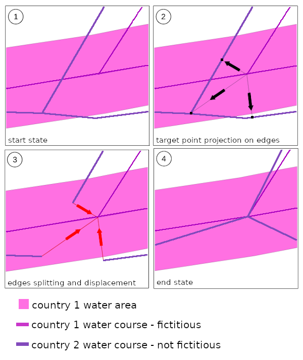
<br>
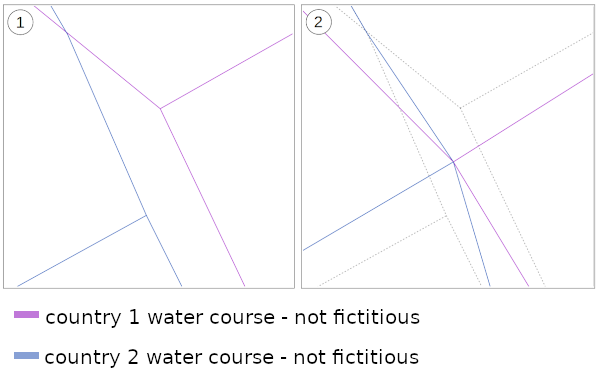


### 204 : GenerateCLinArea

L'objectif de cette étape et de fusionner les objets issus des modélisations des deux pays frontaliers représentant un même objet du monde réel. Les objets résultant de cette fusion sont des _connecting lines_. La valeur de ses attributs est calculée par concaténation des attributs des objets fusionnés.

#### Données de travail :

| table                          | entrée | sortie | entitée de travail | description                                                                                                                  |
|--------------------------------|--------|--------|--------------------|------------------------------------------------------------------------------------------------------------------------------|
| EDGE_TABLE_INIT                | X      | X      | X                  | table du réseau à traiter (à renseigner si suffix (-s) non renseigné en ligne de commande)                                   |
| MATCHED_WATERCOURSE_AREA_TABLE | X      |        |                    | table des cours d'eau surfaciques raccordés aux frontières (à renseigner si suffix (-as) non renseigné en ligne de commande) |
| MATCHED_STANDING_WATER_TABLE   | X      |        |                    | table des surfaces d'eau  raccordés aux frontières (à renseigner si suffix (-as) non renseigné en ligne de commande)         |

#### Principaux opérateurs de calcul utilisés :
- app::calcul::CLInAreaGenerationOp

#### Description du traitement :
Paramètre utilisés: 
| paramètre                       | description                                                                                                                           |
|---------------------------------|---------------------------------------------------------------------------------------------------------------------------------------|
| NATIONAL_IDENTIFIER_NAME        | nom du champ pour l'identifiant national                                                                                              |
| W_TAG_NAME                      | champ de travail permettant de marquer les objets traités                                                                             |
| CLA_SURFACE_WIDTH               | seuil de largeur des surfaces fines                                                                                                   |
| CLA_FICTITIOUS_RATIO_THRESHOLD  | ratio à partir duquel un chemin est considéré comme fictif (longueur des arcs fictifs/longeur totale)                                 |
| CLA_CL_LENGTH_THRESHOLD         | seuil de longeur en dessous duquel les connecting lines composant le contour d'une face fine peuvent être potentiellement effondrées  |
| CLA_CL_MIN_RATIO_IN_AREA        | ratio de longueur en dessous duquel les connecting lines composant le contour d'une face fine peuvent être potentiellement effondrées |
| LIST_ATTR_W                     | liste des attributs de travail (à ne pas fusionner)                                                                                   |
| LIST_ATTR_JSON                  | liste des attributs de type json (utilisé par l'opération de fusion des attributs)                                                    |


Le processus complet peut nécessiter de lancer plusieurs itérations de traitement. En effet, si à l'issu d'un traitement une ou plusieurs fusions ont été opérées alors une itération de traitement supplémentaire sera lancée, car la fusion peut générer de nouveaux cas à traiter. Le processus s'arrête lorsqu'à l'issu d'une itération aucune fusion n'a eu lieu.
Un traitement se déroule en plusieurs étapes:
- ré-initialisation du champ _W_TAG_NAME_ : ce champ est utilisé de manière interne au traitement afin de permettre aux opérateurs de savoir quels objets ont été antérieurement traités par d'autres opérateurs
- création d'un graph planaire à partir de l'ensemble des réseaux des deux pays frontaliers : cette étape permet le chargement en mémoire des données de travail, la création des faces, facilite la détection des arcs superposés...
- fusion des arcs des deux pays superposés
- fusion des arcs des deux pays constituant des faces fines : les faces fines sont traitées si celles-ci sont constituées de deux chemins appartenant aux deux pays et que les éventuelles connecting lines constituants ces chemins ont pu être substituées par un arc non fusionné (cette substitution se base sur le _NATIONAL_IDENTIFIER_NAME_)
- modification et objets possédant des portions fusionnée : seule une ou plusieurs portion(s) de la géométrie d'un arc peu(ven)t avoir été fusionnées, l'arc peut alors être découpé en plusieurs objets fusionnés et non-fusionnés
- modification (déplacement) des arcs incidents : les arcs incidents aux arcs fusionnés deviennent incidents aux _connecting lines_ résultant de la fusion, ils sont positionnés par conservation de l'abscisse curviligne. seule l'extrémité de l'arc incident est modifiée (pas de déformation amortie de l'arc incident)
- nettoyage des connecting lines superposées : correction des artefacts de traitement
- concaténation des arcs possédant le même _NATIONAL_IDENTIFIER_NAME_ : cette étape permet de corriger les découpages superflus créés par le traitement
- effondrement (suppression) des connecting lines : pour chaque face fine on effondre les connecting lines si celles-ci réprésentent une portion de son contour inférieure à _CLA_FICTITIOUS_RATIO_THRESHOLD_ et une longeur inférieure à _CLA_FICTITIOUS_LENGTH_THRESHOLD_. En cas d'effondrement, les éventuels arcs incidents sont déplacés avec un opérateur de déformation amortie.

A noter que la création des connecting lines dans les faces fines prend en compte la propriété _EDGE_FICTITIOUS_NAME_ afin de déterminer leur géométrie. Si l'un des deux objets fusionnés est fictif et l'autre non, c'est la géométrie de l'objet fictif qui sera prise, si les deux objets sont tout deux fictifs ou non-fictifs une géométrie moyenne sera calculée. En cas de fusion de deux arcs fictifs, on vérifie que le résultat de la fusion est bien entièrement inclus dans une surface fusionnée (résultant du traitement _net_area_matching_), si ce n'est pas le cas cette fusion est abandonnée.

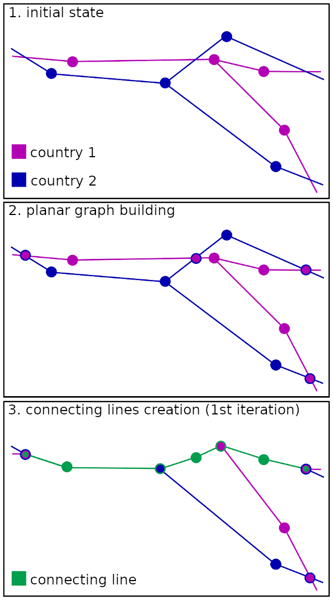
<br>
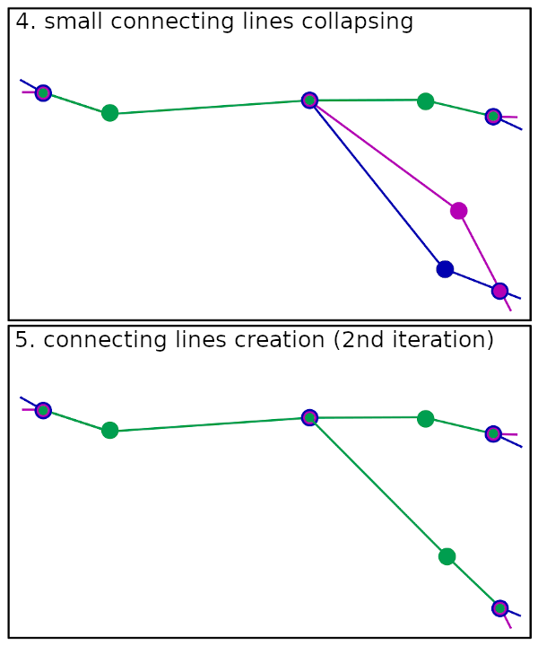


### 210-214 : Generate connecting lines on Border

L'objectif de cette suite d'étapes et la génération de _connecting lines_ résultant de la fusion d'arcs des deux pays localisés à proximité des frontières.
Les _connecting lines_ sont enregistrées dans une table dédiée. C'est lors d'une étape postérieure que ces objets seront injectés dans la table des arcs en replacement des arcs dont ils sont le résultat de la fusion.
_
#### 210 : GenerateConnectingLinesByCountry

L'objectif de cette étape et de générer, pour chaque pays, les connecting lines correspondant à des arcs ou portions d'arcs longeant la frontière. 

##### Données de travail :

| table                          | entrée | sortie | entitée de travail | description                                                 |
|--------------------------------|--------|--------|--------------------|-------------------------------------------------------------|
| CL_TABLE                       |        | X      | X                  | table des connecting lines                                  |
| EDGE_TABLE_INIT                | X      |        |                    | table du réseau à traiter                                   |
| TARGET_BOUNDARY_TABLE          | X      |        |                    | table des frontières                                        |

##### Principaux opérateurs de calcul utilisés :
- app::calcul::CFeatGenerationOp

##### Description du traitement :

Paramètre utilisés: 
| paramètre                     | description                                                                                                                           |
|-------------------------------|---------------------------------------------------------------------------------------------------------------------------------------|
| CL_BUFFER_DIST                | rayon du buffer autour des frontières                                                                                                 |
| CL_THRESHOLD_NO_CL            | seuil de longueur de portion d'arc hors buffer determinant une interruption de connecting line                                        |
| CL_RATIO_IN_BUFFER            | proportion d'une portion d'arc qui doit être situé dans le buffer de la frontière pour pouvoir donner naissance à une connecting line |
| CL_SNAP_ON_VERTEX_BORDER_DIST | distance de snapping de la projection des extremités des arcs sur les points des polylignes des frontières                            |
| CL_BORDER_MAX_ANGLE           | angle maximum entre la frontièere et un arc ou une portion d'arc pour qu'ils puissent générer une connecting line                     |
| CFG_BOUNDARY_ANGLE_THRESHOLD  | seuil d'angle pour le découpage des frontières au niveau des angles aigu (si le paramètre vaut 180, aucun découpage n'est réalisé)    |
| LINKED_FEATURE_ID             | nom du champ indiquant l'identifiant de l'arc associé à une connecting line                                                           |

L'objectif, dans un premier temps, est de déterminer les arcs ou portions d'arcs qui donneront naissance à des connecting lines,
Pour cela un buffer est créé autour de la frontière et chaque arc intersectant celui-ci est découpé selon le contour du buffer.
Pour chaque arc on parcourt l'ensemble de sous-arcs ainsi obtenu et on détermine quelles sont les ensembles de sous-arcs adjacents pouvant donner naissance à des connecting lines.
Un ensemble de sous-arcs est éligible à la génération d'une connecting line si celui-ci n'est composé que de parties localisées à l'interieur du buffer et éventuellemnent de partie hors buffer de longueur inférieur au seuil _CL_THRESHOLD_NO_CL_. Un ensemble éligible donnera effectivement naissance à une connecting line si la proportion (en longueur) des parties situées dans le buffer est supérieur au seuil _CL_RATIO_IN_BUFFER_.

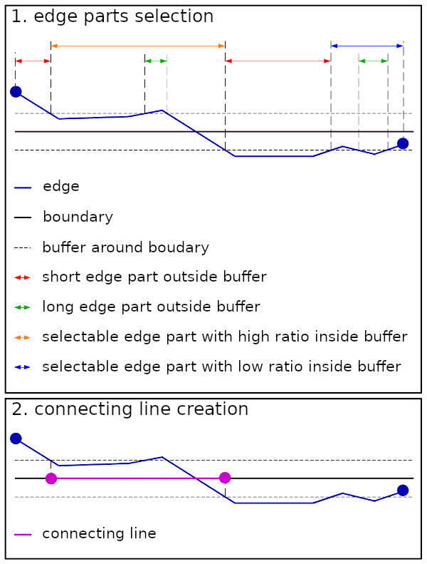


#### 211 : MergeConnectingLinesOnBorder

Le but est ici de fusionner deux à deux les conneEDGE_TABLE_INITcting lines ou portions de connecting lines dont les arcs associés peuvent être appairés. A l'issu de ce traitement il ne doit subsister que des connecting lines associées à deux arcs des deux pays.

##### Données de travail :

| table                          | entrée | sortie | entitée de travail | description                                                 |
|--------------------------------|--------|--------|--------------------|-------------------------------------------------------------|
| CL_TABLE                       | X      | X      | X                  | table des connecting lines                                  |

##### Princi_fsStandingpaux opérateurs de calcul utilisés :
- app::calcul::CFeatGenerationOp

##### Description du traitement :

Paramètre utilisés: 
| paramètre                   | description                                                                                                               |
|-----------------------------|---------------------------------------------------------------------------------------------------------------------------|
| CL_EDGE_MAX_DIST            | distance de hausdorff maximum entre deux portions d'arc pour quelles puissent être fusionnées en une connecting line      |
| CL_SNAP_PROJ_CL_2_EDGE_DIST | distance de snapping de la projection des extremités des connecting lines sur les points des polylignes des arcs associés |
| LINKED_FEATURE_ID           | nom du champ indiquant les identifiants des arcs associés à une connecting line                                           |

Les _connecting lines_ sont enregistrées dans une table dédiée.
La première étape consiste à construire un graph planaire à partir des connecting lines. Les linéaires superposés sont ainsi agrégés et découpés pour former le graph, chaque connexion du graph est ainsi associée à un ou plusieurs arcs du réseau traité.
Pour les connexions du graph possédant plusieurs arcs associés provenant des deux pays, on cherche les meilleurs couples d'arcs à appairer.
Pour qu'un couple d'arcs soit appairable il faut que :
- les deux arcs soient de pays différents
- la distance de hausdorff entre les portions d'arcs associés à la connecting line soit inférieure au seuil _CL_EDGE_MAX_DIST_

Pour chaque couple appairé une connecting line est créée. Toutes les connecting lines ou portions de connecting line non fusionnées sont supprimées.

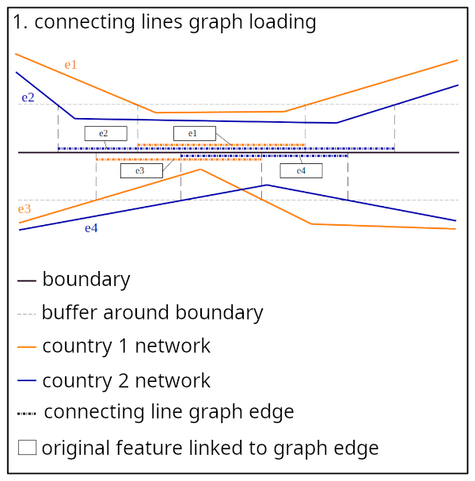
<br>
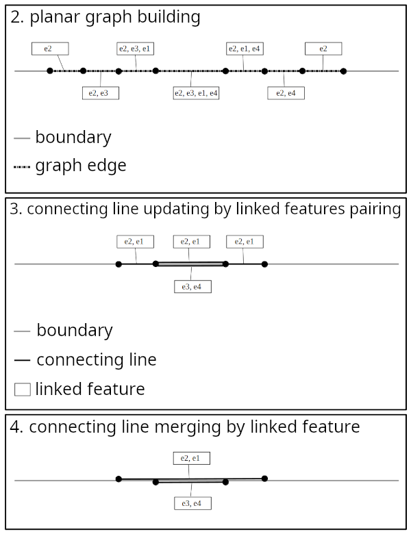


#### 212 : SnapConnectingLines

Cette étape vise à corriger les discontinuités entre les connecting lines qui ont pu être crées par les traitements précédents.

##### Données de travail :

| table                          | entrée | sortie | entitée de travail | description                                                 |
|--------------------------------|--------|--------|--------------------|-------------------------------------------------------------|
| CL_TABLE                       | X   x   | X      | X                  | table des connecting lines                                  |

##### Princi_fsStandingpaux opérateurs de calcul utilisés :
- app::calcul::CFeatGenerationOp

##### Description du traitement :

Paramètre utilisés: 
| paramètre                   | description                                                                                                      |
|-----------------------------|------------------------------------------------------------------------------------------------------------------|
| CL_CL_CLOSEST_MAX_DIST      | seuil de distance entre les extrémités de deux connecting lines en dessous duquel une connection doit être créée |

Pour détecter les discontinuités, un graph des connecting lines est chargé. Pour chaque noeud de degré 1 on recherche s'il existe des extrémités d'autres connecting lines situés à une distance inférieure au seuil _CL_CL_CLOSEST_MAX_DIST_. 
Les extremités proches sont déplacées vers le barycentre de l'ensemble de ces points.

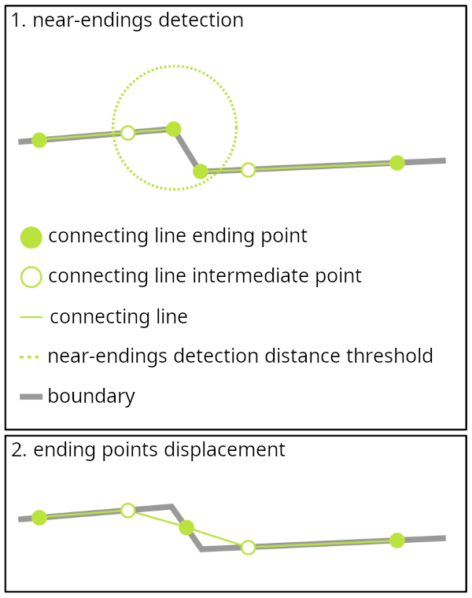


#### 213 : DeleteConnectingLines

Cette étape consiste à supprimer les connecting lines pour lesquelles les arcs associés ne peuvent être fusionnés car trop éloignés ou parce que présentant des orientations trop différentes.

##### Données de travail :

| table                          | entrée | sortie | entitée de travail | description                                                 |
|--------------------------------|--------|--------|--------------------|-------------------------------------------------------------|
| CL_TABLE                       | X      | X      | X                  | table des connecting lines                                  |
| EDGE_TABLE_INIT                | X      |        |                    | table du réseau à traiter                                   |

##### Principaux opérateurs de calcul utilisés :
- app::calcul::CFeatGenerationOp

##### Description du traitement :

Paramètre utilisés: 
| paramètre                   | description                                                                                                               |
|-----------------------------|---------------------------------------------------------------------------------------------------------------------------|
| CL_EDGE_MAX_ANGLE           | angle maximum autorisé entre les deux portions d'arcs associées à une connecting line                                     |
| CL_EDGE_MAX_DIST            | distance de hausdorff maximum autorisée entre les deux portions d'arc associées à une connecting line                     |
| CL_MIN_LENGTH               | longueur minimum d'une connecting line isolée (non connectée à d'autres connecting lines)                                 |
| CL_SNAP_PROJ_CL_2_EDGE_DIST | distance de snapping de la projection des extremités des connecting lines sur les points des polylignes des arcs associés |
| LINKED_FEATURE_ID           | nom du champ indiquant les identifiants des arcs associés à une connecting line                                           |

On charge dans un premier un graphe des connecting lines, puis, pour chaque connecting line dont au moins une des extrémités n'est pas connectée à d'autres connecting lines (noeud de degré 1), on calcule la portion pour chacun des deux arcs associés correspondant à la projection de la connecting line sur l'arc. On obtient ainsi les deux portions d'arc associés à la connecting line.
Une connecting line est supprimée si l'angle entre les orientations de deux portions d'arc est supérieur à _CL_EDGE_MAX_ANGLE_ ou bien si la distance de hausdorff entre elles est supérieure à _CL_EDGE_MAX_DIST_.
En outre, chaque connecting line isolée (non connectée à d'autres connecting lines) dont la longeur est inférieure à _CL_MIN_LENGTH_ et supprimée.

> Note : on désigne ici par orientation d'une polyligne, le vecteur défini par ses deux extrémitées.

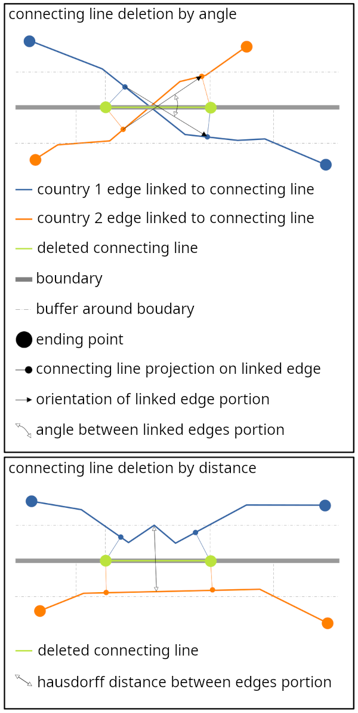

#### 214 : UpdateGeomConnectingLines

Le traitement mis en oeuvre dans cette étape consiste à calculer de nouvelles géométries pour les connecting line qui sont les géométries moyennes calculées à partir des paires de portion d'arc fusionnées. 

##### Données de travail :

| table                          | entrée | sortie | entitée de travail | description                                                 |
|--------------------------------|--------|--------|--------------------|-------------------------------------------------------------|
| CL_TABLE                       | X      | X      | X                  | table des connecting lines                                  |
| EDGE_TABLE_INIT                | X      |        |                    | table du réseau à traiter                                   |

##### Principaux opérateurs de calcul utilisés :
- app::calcul::CFeatGenerationOp

##### Description du traitement :

Paramètre utilisés: 
| paramètre                   | description                                                                                                               |
|-----------------------------|---------------------------------------------------------------------------------------------------------------------------|
| EDGE_FICTITIOUS_NAME        | nom du champ indiquant si l'objet est fictif                                                                              |
| LINKED_FEATURE_ID           | nom du champ indiquant les identifiants des arcs associés à une connecting line                                           |
| CL_SNAP_PROJ_CL_2_EDGE_DIST | distance de snapping de la projection des extremités des connecting lines sur les points des polylignes des arcs associés |

Ce traitement se déroule en deux phases avec une phase intitiale:

0- chargement d'un graph GL à partr du réseau initial de connecting lines.

1- calcul des nouvelles géométries des conneLes _connecting lines_ sont enregistrées dans une table dédiée.cting lines : si les arcs associés à la connecting line sont tous deux fictifs ou non-fictifs, on calcule une géométrie moyenne par interpolation des deux portions d'arcs associés. Si seulement l'un des deux arcs est fictif c'est la géométrie c'est la portion de cet arc associée à la connecting line qui sera pris pour nouvelle géométrie

2- rétablissement des connexions légitimes entre les connecting lines : les connecting lines initialement connectées sont déconnectées après calcul des nouvelles géométries. La création du graph initial GL, préalablement à la modification des géométries, a permis de mémoriser les relations d'adjacence entre les connecting lines qu'il nous faut maintenant rétablir. Tout d'abord nous chargeons deux graphs G1 et G2 à partir des réseaux des deux pays country1 et country2. Ensuite, nous parcourons tous les noeuds de degré supérieur à 2 du graph GL. Pour l'ensemble des connecting lines adjacentes à ce noeud (une connecting line est ici équivalente à un arc du graph) on détermine les groupes de connecting lines qui doivent effectivement rester connectées. Les connecting lines qui doivent être connectées sont celles dont les arcs associés sont identiques ou connectés dans leur réseau respectif (G1 ou G2). Les relations d'adjacence des arcs associés sont retrouvées en interrogeant les graphs G1 et G2. Par exemple, soit 2 connecting lines adjacentes cl1 et cl2 qui ont respectivement pour paires d'arcs associés (country1_1, country2_1) et (country1_1, country2_2). La connexion entre ces deux connecting lines doLes _connecting lines_ sont enregistrées dans une table dédiée.it être rétablie si les arcs country2_1 et country2_2 sont effectivement connectés dans le réseau du pays country2 (la relation d'adjacence est évidente en ce qui concerne les arcs issus du pays country1 puisque les 2 connecting lines sont associées au même arc country1_1). Si une relation d'adjacence est établie entre plusieurs connecting lines, un barycentre est calculé à partir des géométries des extrémités devant être reliées. Ces géométries sont ensuite remplacées par celle du barycentre.

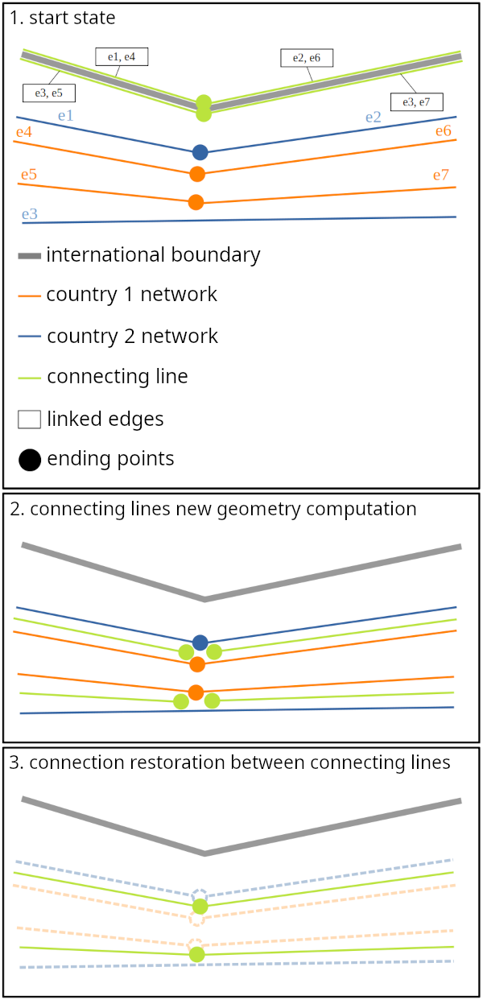

#### 220 : ConnectionConnectingLines

Le but de cette étape est de supprimer arcs ou parties d'arcs ayant fait l'objet d'une fusion et de réaliser les déplacements nécessaires afin de connecter le réseau aux connecting lines résultant de la fusion.

##### Données de travail :

| table                          | entrée | sortie | entitée de travail | description                                                 |
|--------------------------------|--------|--------|--------------------|-------------------------------------------------------------|
| CL_TABLE                       | X      |        |                    | table des connecting lines                                  |
| EDGE_TABLE_INIT                | X      | X      | X                  | table du réseau à traiter                                   |

##### Principaux opérateurs de calcul utilisés :
- app::calcul::CFeatConnectionOp

##### Description du traitement :

Paramètre utilisés: 
| paramètre                   |                                                                                               |
|-----------------------------|-----------------------------------------------------------------------------------------------|
| LINKED_FEATURE_ID           | nom du champ indiquant les identifiants des arcs associés à une connecting line               |
| CFC_SNAP_DIST               | distance de snapping des extrémités d'une connecting line sur les extrémités d'un arc associé |

La première étape du traitement consiste à calculer l'ensemble des déplacements qu'il faudra appliquer au réseau, un déplacement étant représenté par un vecteur associé à la localisation d'un noeud. On profite de cette étape pour découper les arcs en supprimant les parties fusionnées. On effectue un traitement pays par pays. Pour chacun des pays on parcourt les connecting lines. Pour chaque connecting line on récupère l'identifiant de l'arc associé correspondant au pays traité (prenons ici ID pour valeur de cet identifiant). L'objectif étant de supprimer les portions d'arcs fusionnées, on créé une géométrie de travail MERGED_CL correspondant à la fusion des connecting lines connexes à la connecting line traitée et liées au même arc ID, cela permettra de supprimer en un seul passage l'ensemble des portions d'arcs fusionnées contigues. On recherche ensuite dans le réseau le meilleur candidat parmis les arcs pouvant être associés. En effet l'arc associé n'a pas nécessairement pour identifiant ID car cet arc peut avoir été précédemment découpé (un même arc peut présenter plusieurs portions fusionnées non connexes). Pour cela on recherche parmis tous les arcs ayant pour parent l'arc ID celui qui est le plus proche de la géométrie MERGED_CL. Une fois l'arc identifié ID' on regarde si les extrémités de MERGED_CL peuvent être associées à celles de l'arc, sinon calcule les projections de ces extrémités sur l'arc et on découpe l'arc suivant ces points. Parmis les polylignes résultant de la découpe, on supprime celle qui sera remplacée par les connecting lines (celles composant la géométrie MERGED_CL). Les polylignes restantes sont utilisées pour créer de nouveaux objets en remplacement de l'arc ID' (ce sont les parties restantes non associées à cette fusion). Les déplacements sont enregistrés. Ils correspondent aux vecteurs allant des points de coupure ou extrémités de l'arc ID' vers leur extrémité associée de la géométrie MERGED_CL.
<br>
Dans un deuxième temps on charge un graphe composé des réseaux des deux pays et on applique les déplacements précédemment calculés aux noeuds du graphe. On applique une fonction de déformation avec amortissement aux arcs adjacents aux noeuds déplacés.
<br>
La dernière étape consiste à persister en baLes _connecting lines_ sont enregistrées dans une table dédiée.se de données les modifications géométriques réalisées sur les arcs déformés. Les arcs effondrés en un points sont supprimés.

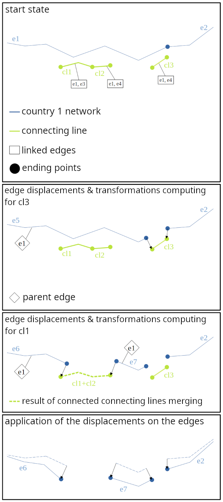


#### 230 : ImportConnectingLines

Lors de cette étape les objets contenus dans la table des connecting lines sont copiés dans la table du réseau traité.

##### Données de travail :

| table                          | entrée | sortie | entitée de travail | description                                                 |
|--------------------------------|--------|--------|--------------------|-------------------------------------------------------------|
| CL_TABLE                       | X      |        |                    | table des connecting lines                                  |
| EDGE_TABLE_INIT                | X      | X      | X                  | table du réseau à traiter                                   |

##### Principaux opérateurs de calcul utilisés :
- app::calcul::CFeatConnectionOp

##### Description du traitement :

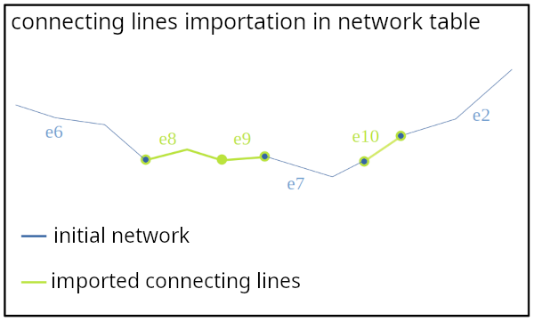


#### 240 : GenerateConnectingPoint

Cette étape à pour objet la création des _connecting points_. Les _connecting points_ ont pour objectif d'assurer la connexion de deux arcs ou groupe d'arcs de deux pays au passage de leur frontière commune. Chaque _connecting point_ est associé à un seul arc. A l'issu du traitement on obtient des groupes de _connecting points_. Les connecting points d'un même groupe sont superposés. Un groupe possède au moins deux _connecting points_ et au moins un _connecting point_ de chacun des deux pays frontaliers traités.
Les _connecting points_ sont enregistrées dans une table dédiée.

##### Données de travail :

| table                          | entrée | sortie | entitée de travail | description                                                 |
|--------------------------------|--------|--------|--------------------|-------------------------------------------------------------|
| CP_TABLE                       | X      | X      | X                  | table des connecting points                                 |
| EDGE_TABLE_INIT                | X      | x      | x                  | table du réseau à traiter                                   |
| TARGET_BOUNDARY_TABLE          | X      |        |                    | table des frontières                                        |

##### Principaux opérateurs de calcul utilisés :
- app::calcul::CFeatGenerationOp

##### Description du traitement :

Paramètre utilisés: 
| paramètre                           |                                                                                               |
|-------------------------------------|-----------------------------------------------------------------------------------------------|
| LINKED_FEATURE_ID                   | nom du champ indiquant l'identifiant de l'arc associé à un connecting point                   |
| CP_FROM_CL_FROM_BORDER_PAIRING_DIST | distance entre un connecting point issu l'intersection avec une connecting line et un connecting point issu de l'intersection avec la frontière en dessous de laquelle ces deux connecting points peuvent être considérés comme des doublons |
| CP_UNDERSHOOT_DIST          | distance maximale entre une extremité d'arc et un connecting point créé par résolution d'undershoot de cette extrémité |
| CP_MERGE_DIST_CP            | distance maximum entre deux CP pour qu'ils soient fusionnable                                 |
| CP_MERGE_DIST_TRACTOR_CP    | distance maximum entre deux CP pour qu'ils soient fusionnable si les arcs associés aux connecting point sont d'un type inclus dans la liste CP_FORM_OF_WAY_EXCEPTION |
| CP_FORM_OF_WAY_EXCEPTION | liste des types d'arcs pour lesquels on applique le paramètre CP_MERGE_DIST_TRACTOR_CP pour la fusion des connectins points |
| FORM_OF_WAY_NAME            | nom du champ définissant le type de l'arc                                                     |
| W_TAG_NAME                  | champ de travail permettant de différentier les connecting points issus de l'intersection avec les connecting lines de ceux issu de l'intersection avec les frontières.


1) La première étape consiste à créer les _connecting points_ par intersection des arcs avec les _connecting lines_.
<br>
2) Lors de la deuxième étape on crée les _connecting points_ par intersection avec les frontières.
<br>

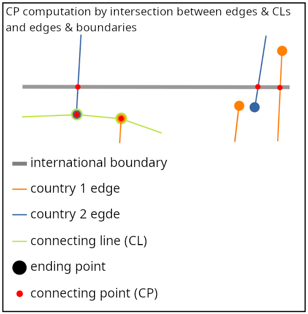

Pour distinguer ces deux types de _connecting points_ (enregistrés dans la même table _CP_TABLE_), on utiliser le champs de travail W_TAG_NAME (ce champ est renseigné pour les _connecting points_ calculés par intersection avec les _connecting lines_).
<br>
3) A ce stade du traitement on cherche à identifier les paires de _CP issu de CL/CP issu de frontière_ liés au même arc (enregistré dans le champ LINKED_FEATURE_ID) et suffisamment proches (distance inférieure à _CP_FROM_CL_FROM_BORDER_PAIRING_DIST_) pour être considérés comme représentant le même noeud de connection.
Pour cela on parcourt les CP issus de frontiere et pour chacun on cherche le CP issu de CL possédant le même LINKED_FEATURE_ID le plus proche dans un rayon de longueur _CP_FROM_CL_FROM_BORDER_PAIRING_DIST_. Considérons CP1, un CP issu de frontière. Si un candidat issu de CL est trouvé on regarde alors si, de manière réciproque, ce dernier à pour plus proche CP issu de frontiere CP1. Si tel est le cas les deux CPs sont considérés comme des doublons et, afin de préserver la cohérence et la connectivité du réseau, le CP issu de frontiere est supprimé.
<br>

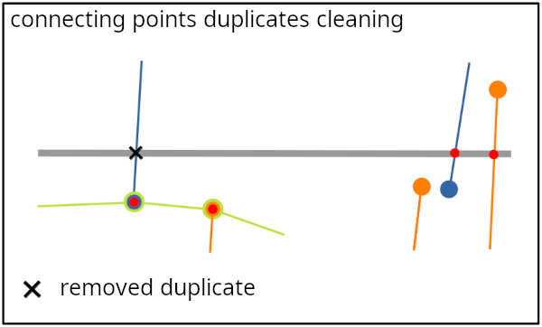

4) Il reste maintenant à créer les _connecting points_ par résolution des sous-dépassements. Cette résolution consiste à calculer un point de croisement entre l'arc en sous-dépassement et la frontière par projection de l'extrémité pendante de l'arc (axialement ou orthogonalement) sur la frontière.
Pour cela on parcourt tous les arcs dont ou moins une des extrémitées et située dans le buffer de rayon _CP_UNDERSHOOT_DIST_ calculé autour des frontières.
Pour chacun de ces arcs on regarde pour chacune de ses extrémités si :
- elle est pendante (i.e. : non connecté au reste du réseau)
- sa distance à la frontière est inférieure à _CP_UNDERSHOOT_DIST_
Pour chacune des extrémités pendante et suffisamment proche on calcule:
- la projection axiale sur la frontière par prolongation du dernier segment de l'arc (ou du premier selon l'extrémité considérée).
- la projection orthogonale sur la frontière. On vérifie que le point projeté ne constitue pas un rebroussement au regard de l'orientation de l'arc. En effet, si l'arc s'éloigne de la frontière on ne souhaite pas qu'un _connecting point_ soit calculé. Afin de savoir si la projection orthogonale de l'extremité P est légitime on re-projette le point projeté sur la frontière P1 sur l'arc afin d'obtenir le point re-projeté P2. On peut alors calculer l'angle (P1 P P2). Si cet angle est trop faible (en dessous d'un seuil) on considère que la projection orthogonale n'est pas légitime.

Les projections axiale et orthogonale ne possèdent pas les même seuils de validité : pour être valable la longueur de la projection axiale doit être inférieure à _CP_UNDERSHOOT_DIST_ alors que, pour la projection orthogonale, le seuil est descendu à un tier de cette valeur.

Si les deux projections on pu être calculées et validées, la projection axiale est privilégiée, sauf si longueur de la projection orthogonale est inférieure à un tier de la longueur de la projection axiale, auquel cas c'est la projection orthogonale qui est préférée à la projection axiale.
Si une seule projection sur les deux à pu être calculée et validée, c'est cette projection qui est appliquée.

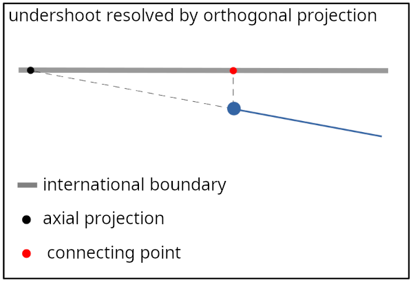

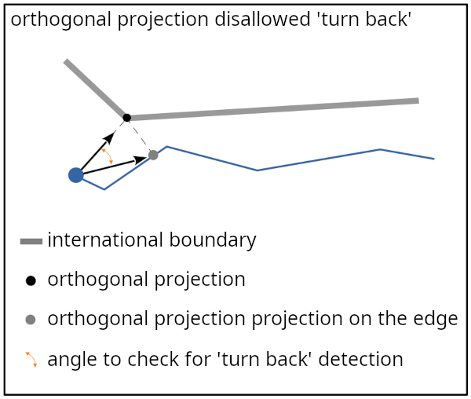

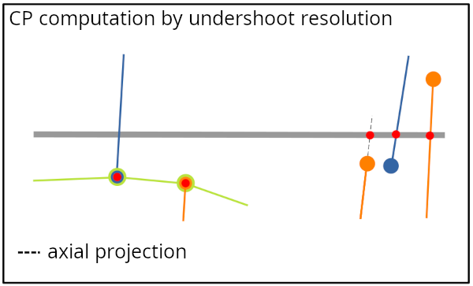

5) Une fois que tous le _connecting points_ potentiels ont été calculés, on opère un regroupement des _connecting points_ proches. Pour cela on parcourt les CP est on recupère pour chasue CP les candidats au regroupement de manière récursive. Le distance de recherche des CP proches pour un CP dépend de sa nature : si la valeur de son champ _FORM_OF_WAY_NAME_ est conmpris dans la liste _CP_FORM_OF_WAY_EXCEPTION_ on applique la distance _CP_MERGE_DIST_TRACTOR_CP_, sinon on applique la distance _CP_MERGE_DIST_CP_. Pour que deux _connecting points_ fassent parti du même regroupement il faut qu'ils soient des candidats réciproques.

Une fois un groupe obtenu, on cherche dans un premier temps à constituer les meilleures paires de CP des deux pays. Pour cela on calcule un tableau des distances entre les CPs d'un pays par rapport aux CPs de l'autre pays. On regarde également pour chaque couple possible de CP si la fusion est légitime. La fusion de deux CP est possible si :
- les arcs associés aux deux CP sont collinéaires : les arcs A1 et A2 sont ici considérés comme collinéaires si le demi-hausdorff de A1 ver A2 est inférieur un seuil ou si le demi hausdorff de A2 vers A1 est inférieur à ce même seuil.
- les CP sont compatibles en terme de distance. On vérifie que CP1 et fusionnable à CP2 et réciproquement compte tenu de leur nature (valeur du champ _FORM_OF_WAY_NAME_) et des seuils de distance qui leur sont donc appliqués pour que la fusion soit autorisée.
Dans un premier temps on calcule les groupes constituées des deux meilleurs candidats réciproques. Ensuite, pour les le CP restant, on les associent au groupe auquel les meilleur candidat est déjà associé.

Une fois les groupe constitué on calcule la géométrie cible vers laquelle tous le CP d'un groupe seront déplacés. Plusieurs cas de figure peuvent se présenter:
- le groupe posséde un ou plusieurs CP issu de CL: 
* si tous les CPs issus de CL sont connectés à une CL commune et qu'ils ne sont pas tous superposés, on calcul un point sur cette CL correspondant à la moyenne des abscisses des CP sur cette CL.
* si tous les CP issus de CL sont superposés le point cible est la géométrie commune de ces CP issus de CL
* s'il y a plusieurs CPs issus de CL, non superposés et pour lesquels il n'existe pas de CL commune à laquelle il serait tous connectés, on calcul le barycentre de ces CP issus de CL (plusieurs CPs superposés comptent pour un seul pour le calcul du barycentre) et on choisi la géométrie du CP issu de CL le plus proche du barycentre comme géométrie cible
- le groupe ne possède pas de CP issu de CL : la géométrie cible est la projection sur la frontière du barycentre des CP (plusieurs CPs superposés comptent pour un seul pour le calcul du barycentre)

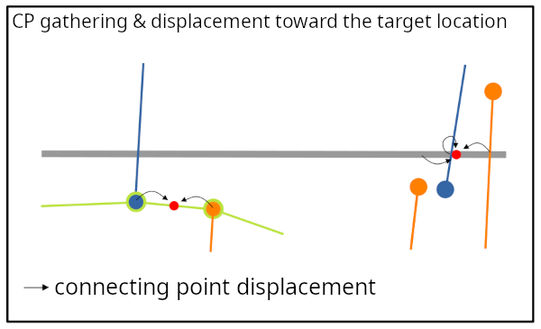

6) Au cours de l'étape précédente la géométrie des CPs peut avoir été déplacée à l'intérieur d'une CL. Pour assurer la cohérence et préserver la connectivité du réseau les CL concernées doivent être découpées au niveau de ces CPs.
Pour cela, on parcourt les CL est pour chacune on récupère les CPs avec lesquels elle est en contact. On calcule les sous-arcs issus de la découpe de la CL par les CP. On remplace alors dans la table des arcs _EDGE_TABLE_INIT_ la CL originelle par les nouvelles CLs résultant de la découpe.

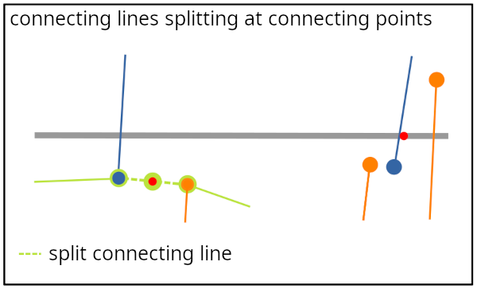


#### 250 : ConnectionConnectingPoint

Lors de cette étape on va connecter les arcs au(x) connecting point(s) auquel(s) ils sont associés.

##### Données de travail :

| table                          | entrée | sortie | entitée de travail | description                                                 |
|--------------------------------|--------|--------|--------------------|-------------------------------------------------------------|
| CP_TABLE                       | X      |        |                    | table des connecting points                                 |
| EDGE_TABLE_INIT                | X      | X      | X                  | table du réseau à traiter                                   |


##### Principaux opérateurs de calcul utilisés :
- app::calcul::CFeatConnectionOp

##### Description du traitement :

Paramètre utilisés: 
| paramètre                   |                                                                                               |
|-----------------------------|-----------------------------------------------------------------------------------------------|
| LINKED_FEATURE_ID           | nom du champ indiquant l'identifiant de l'arc associé à un connecting point                   |
| CFC_SNAP_DIST               | distance de snapping d'une extrémité d'un arc vers un connecting point                        |

Le traitement est réalisé pays par pays.
Pour chaque pays on parcourt donc les _connecting points_ qui lui sont associés.
La première étape consiste à calculer les déplacements et éventuelles découpes des arcs de manière à connecter ces derniers à leurs CPs associés s'ils en possèdent.
Pour chaque _connecting point_ on recherche l'arc qui lui est associé et dont l'identifiant est enregistré dans le champ _LINKED_FEATURE_ID_. Si cet arc n'existe pas c'est qu'il a déjà été découpé lors d'une précédente opération de calcul de déplacement vers un autre CP. En effet, un arc pouvant être lié à plusieurs CP et le calcul du déplacement lié à un CP pouvant engendrer la découpe de l'arc, lorsque l'on recherche l'arc lié a un CP, ce dernier peut ne plus exister s'il a été précédemment découpé. On recherche alors parmis ses enfants (arcs résultants de découpes antérieures) lequel est le plus proche.
Une fois que l'on a identifié l'arc lié au CP, on calcule la distance entre le CP et les extrémité de l'arc. Deux cas peuvent alors se présenter :
- si la plus proche de ces extrémités est à une distance du CP inférieure au seuil _CFC_SNAP_DIST_ le déplacement enregistré est le vecteur allant de cette extrémité vers le CP. Aucune découpe de l'arc n'est alors réalisée.
- si aucune des extrémités n'est à une distance du CP inférieure au seuil _CFC_SNAP_DIST_, alors on projète le CP sur l'arc et l'arc est découpé en ce point. Le déplacement enregistré est le vecteur allant du point projeté vers le CP.

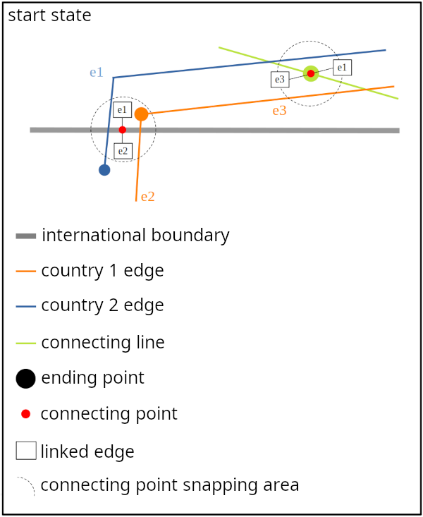
<br>
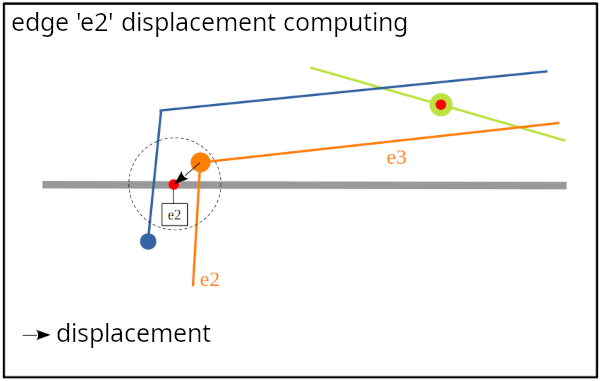
<br>
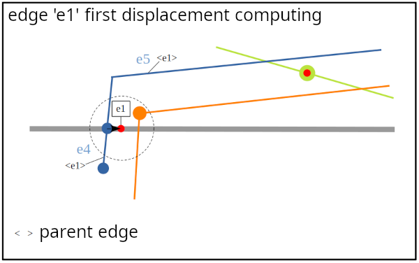
<br>
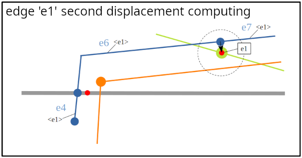
<br>
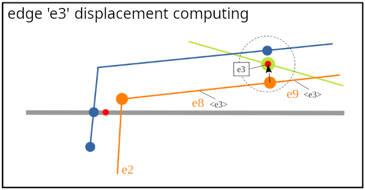

Maintenant que les déplacements ont été calculés la seconde étape consiste à appliquer ces déplacements sur le réseau en veillant à en préserver la cohérence et la connectivité.
Pour cela un graphe simple (non planaire) du réseau du pays est chargé et un opérateur de déformation du réseau selon un champ de vecteur est appliqué : les déplacements sont appliqués aux noeuds du réseau et les arcs adjacents sont déformés en conséquence en appliquant une fonction de déformation amortie.

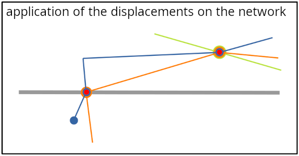

Pour finir les arcs déformés sont enregistrés en base de données et les arcs effondrés en un point sont supprimés.

#### 255 : GenerateCLinArea2

Les étapes précédentes de création d'objets de raccordement (connecting points et lines) et de connexions des réseaux des deux pays à ces objets a pu créer de nouvelles opportunités d'appariemments par l'apparition de faces étroites composées d'arcs des deux pays représentant un même chemin du monde réel.
Pour cette raison l'outil de création de _connecting lines_ dans des faces est relancé à ce stade du traitement.

##### Données de travail :

Ce référer à l'étape 204 du processus qui met en oeuvre le même traitement.

##### Principaux opérateurs de calcul utilisés :
- app::calcul::CLInAreaGenerationOp

##### Description du traitement :

Ce référer à l'étape 204 du processus qui met en oeuvre le même traitement.
<br>
La seule différence avec l'étape 204 est l'utilisation des paramètres CLA_CL_LENGTH_THRESHOLD_2 et CLA_CL_MIN_RATIO_IN_AREA_2 en remplacement des paramètres CLA_CL_LENGTH_THRESHOLD et CLA_CL_MIN_RATIO_IN_AREA ce qui modifie le comportement de l'outil en ce qui concerne le traitement des connecting lines pouvant composer le contour des faces.


#### 260 : EdgeCleaning1

Cette étape correspond à une phase de nettoyage dont le but est d'élmininer les redondances, artefacts ....on non légitimes, pas dans le bon  pays antenne

##### Données de travail :

| table                          | entrée | sortie | entitée de travail | description                                                 |
|--------------------------------|--------|--------|--------------------|-------------------------------------------------------------|
| CP_TABLE                       | X      |        |                    | table des connecting points                                 |
| EDGE_TABLE_INIT                | X      | X      | X                  | table du réseau à traiter                                   |
| TARGET_BOUNDARY_TABLE          | X      |        |                    | table des frontières                                        |

##### Principaux opérateurs de calcul utilisés :
- app::calcul::EdgeCleaningOp

##### Description du traitement :

Paramètre utilisés: 
| paramètre                   |                                                                   |
|-----------------------------|-------------------------------------------------------------------|
| ECL_SQL_FILTER              | clause WHERE sql pour filtrer les arcs à nettoyer                 |
| ECL_SLIM_SURFACE_WIDTH      | seuil de largeur des surfaces fines                               |
| ECL_PARALELLE_EDGE_MAX_DIST | 
| ECL_LANDMASK_BUFFER
| ECL_ANTENNA_RATIO_THRESHOLD
| ECL_ANTENNA_RATIO_WITH_BUFFER_THRESHOLD
| ECL_ANTENNA_MIN_LENGTH
| ECL_ANTENNA_MIN_LENGTH_IN_COUNTRY
| ECL_ARTIFACT_WIDTH                        =2
| ECL_SLIM_SURFACE_MAX_AREA                 optimisation
| ECL_SLIM_SURFACE_MAX_NB_POINTS            optimisation
| W_TAG_NAME                  |


Différentes opérations de nettoyages sont réalisées lors de cette étape :

1) Nettoyage des faces.

L'objectif est d'éliminer les redondances (plusieurs représentations d'un même objet du monde réel). En effet, à ce stade peuvent encore co-exister des modélisations des deux pays d'un même objet formant des faces qui n'auraient pas été fusionnées lors des étapes précédentes.

La première étape consiste à créer les faces en construisant un graphe planaire avec les réseaux des deux pays.
Il nous faut ensuite parcourir les faces du graphe. On analyse chaque face afin de déterminer s'il s'agit d'une face 'étroite'.
Une face étroite est une face de 'forme longiligne' dont la largeur moyenne n'excède pas un certain seuil (ici _ECL_SLIM_SURFACE_WIDTH_).
Dans un premier temps on va chercher à determiner quelles sont les extrémités de la face longiligne. Pour cela on va commencer par générer le squelette de la face puis construire un graphe constitué des arêtes de ce squelette et enfin calculer les chemins entre touts les noeuds de degré 1 du squelette. Les extrémités sont les points correspondants aux noeuds source et cible du chemin le plus long.
Une fois obtenus les points extrèmes on peut extraire du contour de la face les deux côtés de la face longiligne.
Pour qu'une face soit qualifiée de face étroite il faut que :
- la largeur moyenne soit inférieure à _ECL_SLIM_SURFACE_WIDTH_. La largeur moyenne est calculée de la manière suivante : meanLength = 2 * (PolygonArea / PolygonExterirorRingLength)
- la distance de hausdorff entre les deux côtés de la face soit inférieure à 3 * _ECL_SLIM_SURFACE_WIDTH_

Si une face étroite est détectée, on parcourt les arcs de son contour en enregistrant :
- les chemins de chaque pays
- les connexions du contour à des _connecting lines_
- les connexions des chemins au reste du réseau (connexion hors extrémitées du chemin à des arcs du même pays autre que _connecting line_)

Le traitement de la face est abandonné si :
- le contour contient une _connecting line_
- le contour ne possède pas deux et seulement deux noeuds connectés à des _connecting lines_
- il n'existe pas un chemin pour chacun des deux pays
- les deux chemins sont connecté au réseau (hors connexion aux extrémités)

Si la face peut être traitée, il faut déterminer lequel des deux chemins doit être conservé et lequel doit être supprimé.
Si un des deux chemins est connecté au réseau c'est celui là qui sera conservé.
Si aucun des deux chemins n'est connecté au réseau on calcule les ratios de chaque chemin (le ratio d'un chemin correspond ici à la proportion du chemin qui est localisé dans son pays d'origine).
Le chemin qui est conservé est celui qui à le ratio le plus grand.


2) Nettoyage des arcs parallèles.

On cherche ici à éliminer les arcs très proches qui sont des artefacts générés lors d'étapes antérieures.

On construit tout d'abord un graphe simple (non planaire) à partir des réseaux des deux pays. Dans ce graphe un arc du graphe correspond à un arc d'un des réseaux.

On parcourt ensuite les arcs du graphe et pour chaque arc on regarde s'il existe des arcs parallèles (arcs possédant les mêmes sommets).
Si plusieurs arcs paralèlles existent, on choisi parmis eux un arc de référence. Si l'un des arcs correspond à une _connecting line_ c'est lui que l'on choisi, sinon on prend celui qui à le plus grand ratio.
Ensuite, on calcule la distance de hausdorff entre l'arc de référence et chacun des autres arcs. Si cette distance est inférieure au seuil _ECL_PARALELLE_EDGE_MAX_DIST_ l'arc est supprimé.


3) Nettoyage des antennes et des isthmes (faces connectées au réseau par un seul arc)

Le taitement s'effectue pays par pays.
On construit dans un premier temps un graph planaire à partir du réseau d'un pays.
Ensuite, on parcourt les noeuds du graphe, et, pour chaque noeud de degré 1 on récupère l'antenne qui correspond au chemin partant de ce noeud et qui s'achève au premier noeud de degré différent de 2, _connecting point_ ou sommet de _connecting line_ rencontré.
On enregistre les antennes en les regroupant par noeud de convergence.

Une fois cette phase d'enregistrement des antennes achevée, on parcourt les noeuds de convergence.
Pour chaque noeud on parcourt les antennes qui lui y converge.


si antenne connecté à CF est length < ECL_ANTENNA_MIN_LENGTH : supprimée
on calcul les portion dans et hors pays : si premiere partie dans pays et sa length >= ECL_ANTENNA_MIN_LENGTH_IN_COUNTRY --> on garde
  si le ratio de cette partie < ECL_ANTENNA_RATIO_THRESHOLD --> on supprime
  sinon si le ratio d'antenne contenu dans pays+buff < ECL_ANTENNA_RATIO_WITH_BUFFER_THRESHOLD --> on supprime

La derniere antenne n'est pas supprimé si elle conduit à l'apparition d'une nouvelle antenne plus longue (sera traitée dans itération suivante)
VOIR POURQUOI on sort de la suppression des antennes à la première antenne non supprimé ?? l.1579 : isRemoved


toujours avec le même graphe, nettoyage des faces
l.809
ECL_SLIM_SURFACE_WIDTH
ECL_ARTIFACT_WIDTH
ECL_SLIM_SURFACE_MAX_AREA
ECL_SLIM_SURFACE_MAX_NB_POINTS